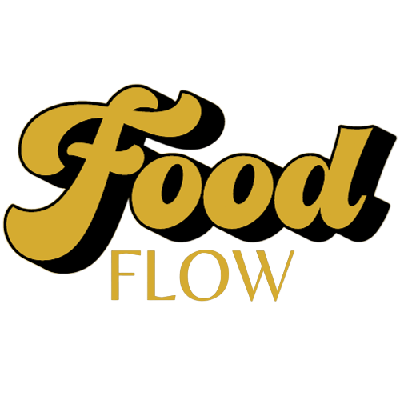

### CSC3104 Cloud & Distributed Compputing: Team 15 (Food Flow 🥨)
2200692 Pang Zi Jian Adrian <br>
2200959 Peter Febrianto Afandy <br>
2201014 Tng Jian Rong <br>
2200936 Muhammad Nur Dinie Bin Aziz <br>
2201132 Lionel Sim Wei Xian <br>
2201159 Ryan Lai Wei Shao <br>

### Overview


Food-Flow is a web-based platform designed to address the challenges of food waste and insecurity in Singapore, by facilitating the responsible redistribution of surplus food. It enables organizations to donate typically discarded excess food items to users in need for free, through listings and reservations.  

It is designed with users at its core, providing real-time notifications of food listings, efficient reservation management, and safeguarding the quality and safety of donated food items, through the employment of AWS cloud services and advanced technologies including browser-based federated learning and Apache Kafka. By leveraging a cloud-native and microservices-based infrastructure using Kubernetes and Docker, and robust data exchange through gRPC and web-sockets, Food-Flow provides a scalable and reliable system, ensuring accessibility and usability for a wide user base.  

Food-Flow is more than a platform; it is a step towards a world whereby every food item is valued and well-utilized. It is aimed at fostering a sense of community and shared responsibility amongst users, by empowering them to build a sustainable future together, one listing and reservation at a time. By connecting donors with users in need, Food-Flow promotes sustainable food practices and aims to reduce the impacts of food waste and insecurity in Singapore.  

### System Architecture
Food-Flow consists of 11 microservices that are orchestrated together using Docker, Kubernetes, and WebSocket. These microservices are split into six front-end microservices that serve as the backbone of the system, with the remaining five microservices catered towards supporting reservation operations.

These microservices include:
- Front-End Microservices:
    - Front-End Microservice (Main UI for Food-Flow platform)
    - Envoy Microservice (For inter-microservice communications)
    - Authentication Microservice (For user authentication and CRUD operations)
    - Listing Microservice (To support food listing operations)
    - Amazon Web Services Microservice (Calls AWS API to access cloud services)
    - Federated Learning Microservice (For distributed machine learning service)
- Reservation Microservices:
    - Kafka Microservice (For handling food reservations)
    - ZooKeeper Microservice (Manages Kafka microservice)
    - React Reservation Microservice (Kafka producer, handles food reservation requests)
    - Reservation Database Microservice (Kafka consumer, backbone of food reservation system)
    - Reservation Socket Microservice (To enable real-time communications)


### Presentation and Demo
To see a walkthrough of the Food-Flow system and our presentation, click [here](https://youtu.be/9H4AzImgLTo), or scan the QR code below!

[](http://www.youtube.com/watch?v=9H4AzImgLTo)

### Directory Structure
```
docs/ (documentation files)
    GROUP15.pdf (article report)
    GROUP15_INSTRUCTIONS.pdf (testing instructions)

img/ (images for this file)

source/ (contains source code for Food-Flow)
    mc-wrapper/ (Docker and Kubernetes files)

    aws-s3-listing-service/ (code for AWS Microservice)

    federated-learning/ (code for Federated Learning Microservice)

    react-auth-service/ (code for Auth Microservice)

    react-envoy-service/ (code for Envoy Microservice)

    react-frontend-service/ (code for Front End Microservice)

    react-listing-service/ (code for Listing Microservice)

    reservation-cluster/ (code for Reservation Microservices)
        react-reservation-service/ (code for React Reservation Microservice)

        reservation-database-service/ (code for Reservation Database Microservice)

        reservation-socket/ (code for Reservation Socket Microservice)

foodflow.sql (SQL migration file for Food-Flow's database)

README.md (this file)
```

### Project Usage
NOTE: This project requires a significant amount of CPU and RAM to run, ensure that your device has at least 8GB of free RAM with a multi-core CPU (at least 3 cores)

NOTE: Each microservice is not designed to be executed independently as they are dependent on the services provided by one another. However, some microservice may still be executed independently but may not work as intended. To do so, build the `Dockerfile` in the respective microservice's folder, and run the created image.

The entire Food-Flow system has been containerized into a Docker image. To run the Food-Flow system locally on your environment, we will run the main Docker image that contains the required `.yaml` files to create the Kubernetes cluster. 

Running the entire Food-Flow project is recommended to ensure that everything works as intended. To run Food-Flow, following the instructions below!

1. Ensure that you have the following software installed on the machine you are using:
    - [Docker](https:/docs.docker.com/engine/install/)
    - [Docker Desktop](https:/docs.docker.com/desktop/install/)
    - [Kubernetes](https://kubernetes.iodocs/tasks/tools/)
    - [Minikube](https://minikube.sigs.k8s.iodocs/start/)
2. Food-Flow requires the use of the following local ports to run, ensure that they are kept free and exposed in your machine's firewall settings:
    ```
    Port 3000 (for Front-End Microservice)
    Port 9900 (for Envoy Microservice)
    ```
3. Ensure that your Kubernetes namespace food-flow is cleared
    ```
    kubectl delete namespace food-flow
    ```
4. Remove any existing minikube configurations, if any
    ```
    minikube delete
    ```
5. To handle its storage needs, a database has been pre-configured and is running on the cloud. However, if you intend to use your own database, follow the following instructions:
    - Create a SQL database
    - Import Food-Flow's database into your new database!
        ```
        mysql -u<username> -p <your database> < foodflow.sql
        ```
    - Modify the `food-flow` Docker image's `secrets.yaml` file with your database connection details (URL, host and password), ensuring that they are all base64 encoded.
6. Run the `food-flow` Docker image!

    For Windows-based devices
    ```
    docker run -it --rm -v /var/run/docker.sock:/var/run/docker.sock -v $HOME/.kube/config:/root/.kube/config skyish/food-flow:windows
    ```

    For Mac-based devices
    ```
    docker run -it --rm -v /var/run/docker.sock:/var/run/docker.sock -v $HOME/.kube/config:/root/.kube/config skyish/food-flow:mac
    ```
7. Once an interactive terminal within the Docker container has been obtained, ensure that all the containers in the `food-flow` namespace are running. This process may take a while as the project consists of 11 different microservices that need to be executed together with other load-balancing and scaling operations!
    ```
    # Within Docker container
    kubectl get all -n food-flow
    ```

    You should wait until all respective pods are up and running before proceeding. An example of an expected output is provided below:
    ```
    /app # kubectl get all -n food-flow
    NAME                                                   READY   
    pod/aws-s3-listing-deployment-64895d6868-rjm4f         1/1     
    pod/aws-s3-listing-deployment-64895d6868-s2mkz         1/1     
    pod/federated-flask-deployment-6d96d5d5f8-6c7pr        1/1     
    pod/federated-flask-deployment-6d96d5d5f8-tlldh        1/1     
    pod/kafka-deployment-1-f57fc5fbc-flsxx                 1/1     
    pod/kafka-deployment-2-6f5769c7c5-kf2sz                1/1     
    pod/react-auth-deployment-6b84556ddf-hc64l             1/1     
    pod/react-auth-deployment-6b84556ddf-vzctj             1/1     
    pod/react-envoy-deployment-6556f5fd57-fzh7x            1/1     
    pod/react-frontend-deployment-8466d49c9-4vl2x          1/1     
    pod/react-frontend-deployment-8466d49c9-htb7t          1/1     
    pod/react-listing-deployment-6fdccb46ff-54th8          1/1     
    pod/react-listing-deployment-6fdccb46ff-llmdq          1/1     
    pod/react-reservation-deployment-6bb674fd69-4l85l      1/1     
    pod/react-reservation-deployment-6bb674fd69-5s4lk      1/1     
    pod/reservation-database-deployment-7ff47c6cc5-2k4fj   1/1     
    pod/reservation-database-deployment-7ff47c6cc5-4p2j4   1/1     
    pod/reservation-socket-deployment-6fd569cb79-7n8r4     1/1     
    pod/reservation-socket-deployment-6fd569cb79-j2qbg     1/1     
    pod/zookeeper-deployment-1-7989c6c445-vtxsw            1/1     
    pod/zookeeper-deployment-2-7989c6c445-p92zn            1/1     

    NAME                                 TYPE           CLUSTER-IP       EXTERNAL-IP   PORT(S)                          
    service/aws-s3-listing-service       ClusterIP      10.109.119.33    <none>        5001/TCP                         
    service/federated-flask-service      ClusterIP      10.111.180.72    <none>        80/TCP                           
    service/kafka-service-1              LoadBalancer   10.104.148.45    localhost     9092:31079/TCP,29092:32098/TCP   
    service/kafka-service-2              LoadBalancer   10.106.23.248    localhost     9092:31894/TCP,39092:32645/TCP   
    service/react-auth-service           ClusterIP      10.110.72.235    <none>        5000/TCP                         
    service/react-envoy-service          LoadBalancer   10.106.152.230   localhost     9900:30804/TCP,9901:30532/TCP    
    service/react-frontend-service       LoadBalancer   10.96.102.193    localhost     3000:32241/TCP                   
    service/react-listing-service        ClusterIP      10.99.112.80     <none>        5002/TCP                         
    service/react-reservation-service    ClusterIP      10.100.44.246    <none>        5003/TCP                         
    service/reservation-socket-service   LoadBalancer   10.107.145.32    localhost     8282:30626/TCP                   
    service/zookeeper-service-1          LoadBalancer   10.101.138.251   localhost     22181:31424/TCP                  
    service/zookeeper-service-2          LoadBalancer   10.100.180.172   localhost     32181:32064/TCP                  

    NAME                                              READY   UP-TO-DATE   AVAILABLE   
    deployment.apps/aws-s3-listing-deployment         2/2     2            2           
    deployment.apps/federated-flask-deployment        2/2     2            2           
    deployment.apps/kafka-deployment-1                1/1     1            1           
    deployment.apps/kafka-deployment-2                1/1     1            1           
    deployment.apps/react-auth-deployment             2/2     2            2           
    deployment.apps/react-envoy-deployment            1/1     1            1           
    deployment.apps/react-frontend-deployment         2/2     2            2           
    deployment.apps/react-listing-deployment          2/2     2            2           
    deployment.apps/react-reservation-deployment      2/2     2            2           
    deployment.apps/reservation-database-deployment   2/2     2            2           
    deployment.apps/reservation-socket-deployment     2/2     2            2           
    deployment.apps/zookeeper-deployment-1            1/1     1            1           
    deployment.apps/zookeeper-deployment-2            1/1     1            1           

    NAME                                                         DESIRED   CURRENT   READY   
    replicaset.apps/aws-s3-listing-deployment-64895d6868         2         2         2       
    replicaset.apps/federated-flask-deployment-6d96d5d5f8        2         2         2       
    replicaset.apps/kafka-deployment-1-f57fc5fbc                 1         1         1       
    replicaset.apps/kafka-deployment-2-6f5769c7c5                1         1         1       
    replicaset.apps/react-auth-deployment-6b84556ddf             2         2         2       
    replicaset.apps/react-envoy-deployment-6556f5fd57            1         1         1       
    replicaset.apps/react-frontend-deployment-8466d49c9          2         2         2       
    replicaset.apps/react-listing-deployment-6fdccb46ff          2         2         2       
    replicaset.apps/react-reservation-deployment-6bb674fd69      2         2         2       
    replicaset.apps/reservation-database-deployment-7ff47c6cc5   2         2         2       
    replicaset.apps/reservation-socket-deployment-6fd569cb79     2         2         2       
    replicaset.apps/zookeeper-deployment-1-7989c6c445            1         1         1       
    replicaset.apps/zookeeper-deployment-2-7989c6c445            1         1         1       

    NAME                                                            REFERENCE                              TARGETS   MINPODS   MAXPODS   REPLICAS   
    horizontalpodautoscaler.autoscaling/federated-flask-deployment  Deployment/federated-flask-deployment  0%/80%    2         5         2
    horizontalpodautoscaler.autoscaling/react-frontend-deployment   Deployment/react-frontend-deployment   21%/80%   2         8         2
    ```

    When running on a Mac device, you may encounter issues with Kubernetes' API as follows:
    ```
    **E1110 11:28:05.888283      47 memcache.go:265] couldn't get current server API group list: Get "http://localhost:8080/api?timeout=32s": dial tcp 127.0.0.1:8080**

    **: connect: connection refused**

    **E1110 11:28:05.892096      47 memcache.go:265] couldn't get current server API group list: Get "http://localhost:8080/api?timeout=32s": dial tcp 127.0.0.1:8080**

    **: connect: connection refused**
    ```
    
    To fix this issue, perform the following steps:
    - Edit the configuration in `/root/.kube/config`` (VIM is installed in the image)
        ```
        vi /root/.kube/config
        ```
    - Edit the “server” option in `/root/.kube/config` to the below:
        ```
        server: https://kubernetes.docker.internal:6443
        ```
    - Save and test the configuration:
        ```
        kubectl get all -n food-flow
        ```
8. Enter the Food-Flow web application by opening up [http://localhost:3000](http://localhost:3000) in your browser.
9. Enjoy making a food listing and reserving food listings on Food-Flow!