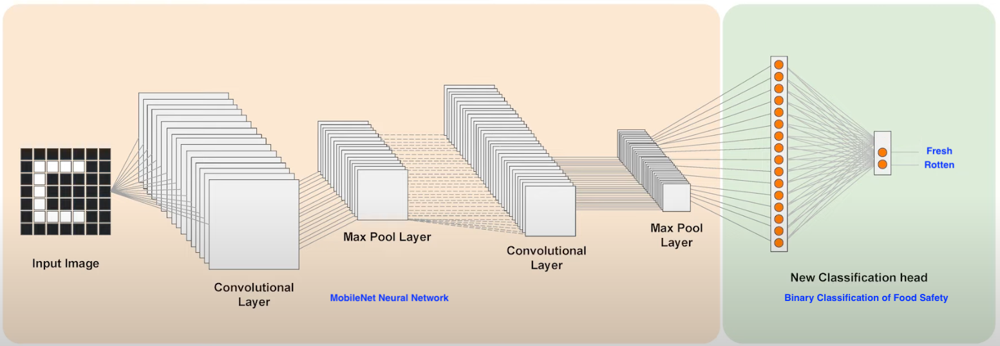
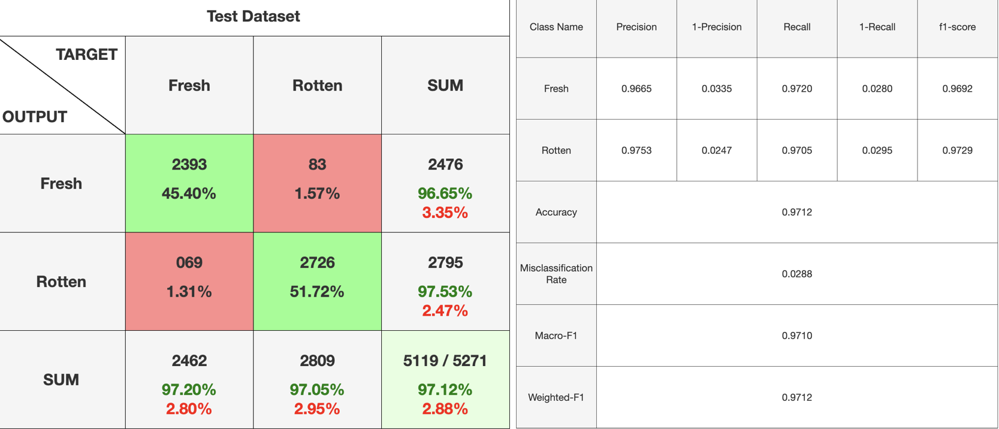

## Food Safety Global Model
This section contains code that is used to train the global model for the binary classification of food images as `Fresh` or `Rotten` for food safety. This is used as a mechanism to prevent users on the Food Flow platform from creating listings of unsafe food for donations.

### Model Overview
---
The global model is built on top of Google's [mobilenet](https://tfhub.dev/google/tfjs-model/imagenet/mobilenet_v3_small_100_224/feature_vector/5/default/1) using transfer learning for the binary classification of food into `Fresh` (safe for consumption) or `Rotten` (unsafe for consumption). It is trained on the entire dataset of nine subsets of food items (explained more [here](#dataset)).

Transfer learning is used to optimise the `mobilenet` neural network for classification of food safety (whether it is rotten or fresh) through the attachment and training of a new classification head. 

Instead of building a model from scratch, transfer learning is used to build on top of the `mobilenet_v3_small` model which provides feature vectors of a neural network trained on the ImageNet dataset consisting of 1.4 million images and 1000 classes (ILSVRC-2012-CLS) and capable of recognising over 1000 image object types, allowing for faster training and better model performance.

### Dataset
---
This model is trained on the [Fresh-and-Stale Classification](https://www.kaggle.com/datasets/swoyam2609/fresh-and-stale-classification) dataset provided on Kaggle. The dataset consists of nine subsets of fruits and vegetables, each classified as `Fresh` or `Rotten`.

These data subsets include:
- Fruits
    - Apples
    - Bananas
    - Oranges
- Vegetables
    - Bitter Gourd
    - Capsicum
    - Cucumber
    - Okra
    - Potato
    - Tomato

The dataset consists of random yet realistic transformations on food images, such as rotation and horizontal flipping, which will help to expose the model to different aspects of training data and reduce overfitting (data augmentation). 

This existing dataset is further preprocessed to remove duplicate images and split into a 80-20 train-test split for subsequent model training and testing. The dataset used can be downloaded [here](https://gla-my.sharepoint.com/:f:/g/personal/2837303a_student_gla_ac_uk/EsoScVNdFYNLr1fTXIFGmg4BG9Oqs39gXxsTrFhGbxy5nw?e=Qlo3qO) (*password: `foodflow`*).

### Model Performance and Tuning
---
After training and fine-tuning, the global model was able to correctly classify each subset of food item into the binary classes of `Fresh` and `Rotten` with the following metrics: <br>
```
| Metric       | Value   |
| ------------ | ------- |
| Accuracy     | 97.12%  |
| Miss         | 2.88%   |
| Precision    | 0.97    |
| Recall       | 0.97    |
| Specificity  | 0.97    |
| F1 Score     | 0.97    |
```



To view detailed specifics on the global model's performance on each subset of data, refer to the `output/global` folder.

Various model training configurations were tweaked and tried to obtain the optimal model, including changing the order of data subset used to train the model, data augmentation on dataset images, and experimentations using models trained on individual subsets of data.

In summary, the order of data subset used to train the model did not result in any significant change in the global model's performance. However, using a model trained on all training data of each subset of data yielded better performance compared to using a model that is only trained on subsets of data, even on test data of the subset that it is trained on. As such, the final global model prepared is trained on ALL training data of each subset of data.

### Directory Structure
---
```
dataset/ (contains images used for model training and testing)

docs/ (documentation images)

models/ (contains exported Tensorflow models)

output/ (contains output of model training and testing)

package.json (Node Modules required for this project)

package-lock.json (Dependencies of each node module)

server.js (Main program used for training and testing the global model over the entire dataset)

subset.js (Supplementary program used for training and testing models over a subset of the dataset)
```

### Program Usage
---
| Note: Running the program on a **Linux-based server** with `NodeJS` installed is preferred.

The final global model has already been prepared, and is accessible in the Tensorflow.js required `model.json` and `weights.bin` format in the `models/global` directory.

However, you may wish to train the global model again or to test the model by running the following commands:

1. Install all necessary programs and libraries (`NodeJS`)
    ```
    # Debian-based Linux Installation (perform your own form of installations if installing on another type of device)
    sudo apt update
    sudo apt-get -y install build-essential libcairo2-dev libpango1.0-dev libjpeg-dev libgif-dev librsvg2-dev git
    sudo apt-get install -y ca-certificates curl gnupg
    sudo mkdir -p /etc/apt/keyrings
    curl -fsSL https://deb.nodesource.com/gpgkey/nodesource-repo.gpg.key | sudo gpg --dearmor -o /etc/apt/keyrings/nodesource.gpg
    NODE_MAJOR=20
    echo "deb [signed-by=/etc/apt/keyrings/nodesource.gpg] https://deb.nodesource.com/node_$NODE_MAJOR.x nodistro main" | sudo tee /etc/apt/sources.list.d/nodesource.list
    sudo apt-get install nodejs npm -y
    ```
2. Install the necessary project dependencies
    ```
    # NodeJS
    npm install canvas
    npm install @tensorflow/tfjs-node

    OR

    # Ensure you are within this directory with package.json
    npm install
    ```

3. The global model has already been pre-trained ahead of time and you should normally not need to re-train it again. However, if you choose to re-train the global model, run the following command:
    ```
    node server.js
    ```

    To train smaller models on specific subsets of the data, run the following command, ensuring that the `MODEL_PATH`, `train_folder` and `test_folder` variables within `subset.js` are pointing to the correct target dataset:
    ```
    node subset.js
    ```

    Both `server.js` and `subset.js` can also be used just to test the performance of models. To do so, ensure that `await train_ml();` is commented out and run each program accordingly.

4. Make a copy of the final `model.json` and `weights.bin` model files and copy them over to the Flask server, for federated learning. These files should be copied over to the `models/global` and `models/` folder on the Flask server. Refer to the instructions for deploying the Flask server for more information!